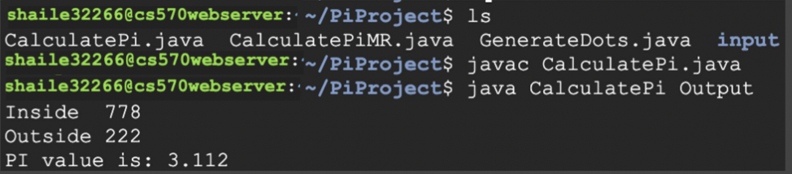

The `README.md` file is written in Markdown, a lightweight markup language that allows you to format text. When rendered correctly (e.g., on GitHub or in a Markdown viewer), it should display formatted text, headings, code blocks, links, and images.

If the file is not displaying correctly, it could be due to:

1. **Improper File Extension**: Ensure that the file is saved with the `.md` extension.
2. **Viewing in a Plain Text Editor**: Some text editors may not render Markdown formatting. Try using a Markdown viewer or editor, or view it directly on a platform like GitHub.
3. **Incorrect Markdown Syntax**: Ensure the Markdown syntax is correct. However, the provided Markdown seems correct.

To verify and view the rendered Markdown properly, you can:

1. **Use a Markdown Editor**: Use an editor that supports Markdown rendering, such as VS Code, Atom, or a dedicated Markdown editor like Typora.
2. **View on GitHub**: If you have committed and pushed the `README.md` file to a GitHub repository, navigate to the repository on GitHub to see the rendered version.
3. **Online Markdown Viewer**: Use an online Markdown viewer to paste the content and see it rendered.

Here’s the provided Markdown again, which should render correctly:

```markdown
# MapReduce Pi Calculation Project

## Overview

This project implements a MapReduce program to estimate the value of Pi using the Monte Carlo method. The Monte Carlo method is a statistical technique that uses random sampling to estimate numerical results. In this case, we simulate dart throws at a square board enclosing a unit circle to approximate the value of Pi.

## Setup

### Environment Setup

To run this project, you need to set up a development environment with the following prerequisites:

- Java Development Kit (JDK) installed
- Apache Hadoop installed and configured
- Eclipse IDE (or any Java IDE of your choice) for development

### Download Programs and Related Documentation

1. Clone this repository to your local machine:
   ```
   git clone https://github.com/sharon20222/Cloud-Computing.git
   ```

2. Ensure that you have Apache Hadoop installed and configured on your system. Refer to the [official Hadoop documentation](https://hadoop.apache.org/docs/) for installation instructions.

3. Open the project in your preferred Java IDE (e.g., Eclipse).

4. Compile the Java source files (`GenerateRandomNumbers.java` and `PiCalculation.java`) to generate the executable JAR files.

## Execution

### Step 1: Generate Input Files

1. Run the `GenerateRandomNumbers.java` program to create input files containing random (x, y) pairs within a specified radius. Save these files in the `input/` directory.

### Step 2: Run MapReduce Job

1. Compile `PiCalculation.java` and package it into a JAR file.

2. Execute the MapReduce job using Apache Hadoop. Run the following command in the terminal:
   ```
   hadoop jar PiCalculation.jar PiCalculation input/ output/
   ```

3. Monitor the progress of the MapReduce job in the terminal. Once completed, you'll find the output files in the `output/` directory.

### Step 3: View Results

1. Open the output files generated by the MapReduce job to view the estimated value of Pi.

## Screenshots



## Contributing

Contributions to this project are welcome! If you have any suggestions, improvements, or bug fixes, feel free to open an issue or submit a pull request.

## Keywords

MapReduce, Pi Calculation, Monte Carlo Method, Java, Hadoop, Distributed Computing, Big Data, Apache, README, Documentation.

## Presentation

For more details, you can refer to the [Google presentation slides](https://docs.google.com/presentation/d/14XJkJxsRKIIvfrAIWaXOGuTj1gseSTgBM-mOf3E-Yi4/edit?usp=sharing).
```

Ensure that your text editor or viewer supports Markdown and that the file is named `README.md` to enable proper rendering.
